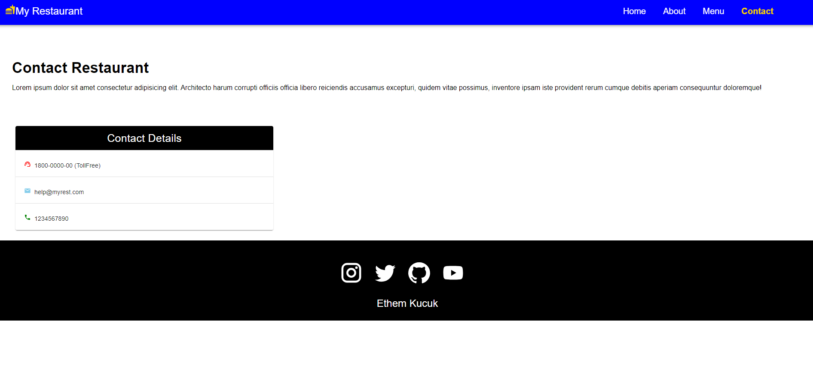

# React Proje 

Bu proje, React ile oluşturulmuş harika bir web uygulamasını içerir.

## Kurulum

Projeyi yerel makinenize kurmak için aşağıdaki adımları izleyin:

1. Bu depoyu klonlayın.
2. Proje dizinine gidin: `cd proje-dizini`
3. Bağımlılıkları yüklemek için: `npm install`

## Kullanım

Projeyi başlatmak için aşağıdaki komutu kullanın:

## Görseller

Bu sitenin görselleri aşağıdaki gibi sıralanmıştır:

1. 
2. 
3. 

## Kullanım

Bu sitede gezin ve Ethem Küçük'ün projelerini inceleyin. Görseller üzerine tıklayarak daha fazla ayrıntıya erişebilirsiniz. Sitenin kullanımı oldukça basittir ve gezinme işlemi kolaydır.

## İletişim

Ethem Küçük ile iletişime geçmek veya daha fazla bilgi almak için aşağıdaki iletişim bilgilerini kullanabilirsiniz:

- Email: ethemk10k@gmail.com
- LinkedIn: [Ethem Küçük]([https://www.linkedin.com/in/ethemkucuk](https://www.linkedin.com/in/ibrahim-ethem-k%C3%BC%C3%A7%C3%BCk-a2696b201/))

  ## Not

  Bu site özgün bir değer taşımamaktadır, kendimi geliştirme ve öğrenme amacıyla yapılmıştır.

---
